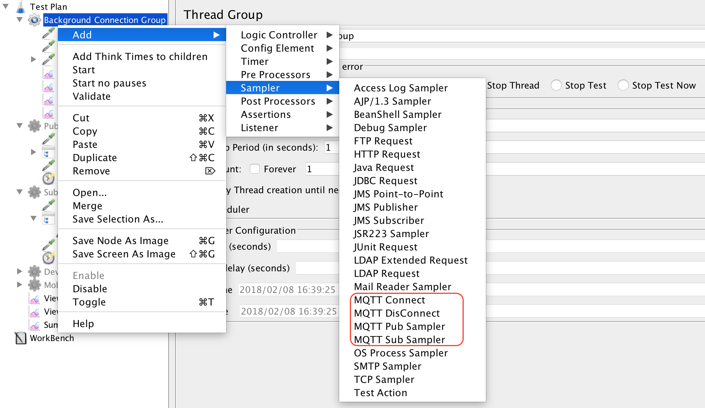
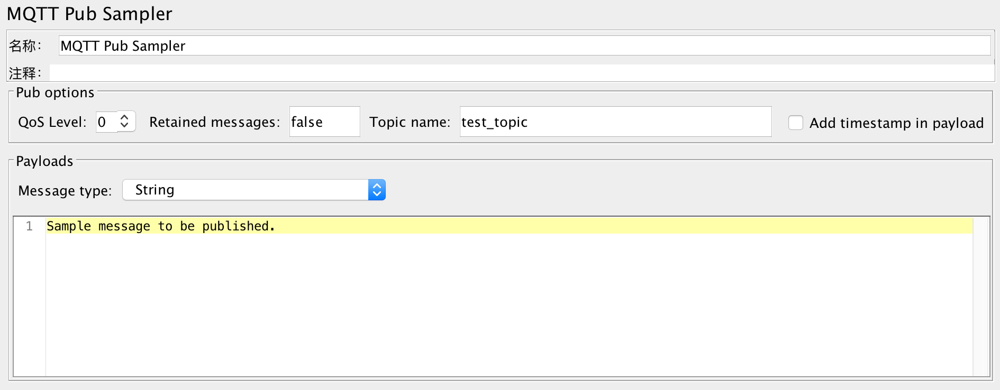

# Release
The version 1.0 is released at 18th, Dec, 2017. Now the plugin supports share MQTT connection in the same threadgroup. Also, this version fixed some of bugs reported in the community.

# mqtt-jmeter
MQTT JMeter Plugin, it's used for testing MQTT protocol. The plugin was used for EMQ's performance benchmark test, and here is [report link](https://github.com/emqtt/emq-xmeter-cn).
The plugin is developed and maintained by [XMeter](https://www.xmeter.net). XMeter is a professional performance testing service provider.

# Install instruction
The plugin is a standard JMeter plugin. You can download the latest version of mqtt-jmeter from [here](https://github.com/emqtt/mqtt-jmeter/releases), and then copy the downloaded JAR files into $JMETER_HOME/lib/ext folder. After restart the JMeter, then you can see the 3 samplers provided by this plugin.

We recommend to use JMeter 3.0 or above. 

## Build from source code

If you'd like to build binary by yourself, please clone the project and run 'mvn install'. Maven will download some JMeter dependency binary files, so the build elapsed time will up to your network status.

# How to use
The plugin includes 3 samplers: 

- Connection sampler, which can be used for connection mock. For example, in a large scale system, there could have lots of backend connections with no data transimission except some hearbeat signal. The sampler can be used in this case.

- Pub sampler, which can be used for publish message to MQTT server.

- Sub sampler, which can be used for sub message from MQTT server.

If MQTT JMeter plugin is installed successfully, then open JMeter and below 3 MQTT samplers can be found under 'Sampler'.




## Connection sampler


### MQTT connection

This section includes basic connection settings.

- **Server name or IP**: The server install with MQTT server, it can be either IP address or server name. The default value is 127.0.0.1. **DO NOT** add protocol (e,g tcp:// or ssl:// etc) before server name or IP address! 

- **Port number**: The port that opens by MQTT server, the default value is 1883 for TCP protocol, and normally 8883 for SSL protocol.

- **MQTT version**: The MQTT version, default is 3.1, and another option is 3.1.1. E,g, sometimes the version is probably required for establish connection to [Azure IoTHub](https://github.com/emqtt/mqtt-jmeter/issues/21).

- **Timeout(s)**: The connection timeout seconds while connecting to MQTT server. The default is 10 seconds.

### MQTT Protocol

The sampler supports for 2 protocols, TCP and SSL. For the SSL protocol, it includes normal SSL and dual SSL authentication. 

If **'Dual SSL authentication'** is checked, please follow 'Certification files for SSL/TLS connections' at end of this doc configure client SSL configuration.


### User authentication

User can configure MQTT server with user name & password authentication, refer to [EMQ user name and password authentication guide](http://emqtt.com/docs/v2/guide.html#id3).

- **User name**: If MQTT server configured with user name, then specify user name here.

- **Password**: If MQTT server configured with password, then specify password here.

### Connection options

- **ClientId**: The client id, the plugin will add generated uuid after the prefix to identify the client if keep 'Add random client id suffix' selected. Default value is 'conn_'. If 'Add random client id suffix' is not selected, then the text of 'ClientId' will be passed as 'clientId' of current connection.

- **Keep alive(s)**: Ping packet send interval in seconds. Default value is 300, which means each connection sends a ping packet to MQTT server every 5 minutes.

- **Connection keep time(s)**: The value is for setting the connection elapsed time after successfully established MQTT connection. The default value is 1800 seconds, which means that the connection will be alive within 30 minutes.

- **Connect attampt max**: The maximum number of reconnect attempts before an error is reported back to the client on the first attempt by the client to connect to a server. Set to -1 to use unlimited attempts. Defaults to 0.

- **Reconnect attampt max**:  The maximum number of reconnect attempts before an error is reported back to the client after a server connection had previously been established. Set to -1 to use unlimited attempts. Defaults to 0.

## Pub sampler


For **MQTT connection**, **User authentication**,  **Connection options** and **MQTT version** section settings, please refer to *Connection sampler* for more detailed information.

- **Share conn in thread**: This option allows all of pub and sub samplers in the same threadgroup shares the same connection, this can simulate the situation of one device can be either pub or sub. For example, one IoT device can either send message to server, or receive the control message from server. Please notice, only those samplers in the same threadgroup check this option, then the connection will be shared. Also, the connection settings of first pub/sub sampler in the threadgroup will be used for shared connections, rests of connection settings in other samplers will be ignored if the option is checked. Please take a look at following 3 examples.

```
ThreadGroupSample1
  PubSampler1 (shared connection), the connection settings will be used for the shared connection.
  SubSampler1 (shared connection), use shared connection of PubSampler1, the connection setting of this sampler will be ignored.


ThreadGroupSample2
  PubSampler1 (shared connection), the connection settings will be used for the shared connection.
  SubSampler1 (not shared connection), another connection will be created with configuration in this sampler.


ThreadGroupSample3
  PubSampler1 (not shared connection), one connection will be created for the connection setting in this sampler.
  SubSampler1 (shared connection), the connection settings will be used for the shared connection.
  SubSampler2 (shared connection), use shared connection of SubSampler1, so the connection setting of this sampler will be ignored.

```

### Pub options

- **QoS level**: The available QoS value, 0 is AT_MOST_ONCE, 1 is AT_LEAST_ONCE and 2 is EXACTLY_ONCE.

- **Topic name**: The topic name that the message will send to.

- **Add timestamp in payload**: Add timestamp in the payload or not. If the checkbox is enabled, then timestamp of running pub sampler will be added ahead of payload. Mostly it can be used together with **Sub sampler** to calculate message latency time.

### Payloads

**Message type**: 3 types of message can be used. 

- String: The normal string that sent to MQTT server. It can also be a JMeter variable.

- Hex string: The hex string that sent to MQTT server. The chars input must be [0-9] or [A-F] or [a-f]. The hex string will be converted to binary and send to server. It can also be a JMeter variable.

- Random string with fixed length: Refer to below screenshot. If the option is selected, then it requires user to input 'Length'. The length means the auto generated string length. Default is 1024, which means generated a 1kb size of random string.


## Sub sampler


For **MQTT connection**, **User authentication**,  **Connection options** and **MQTT version** section settings, please refer to *Connection sampler* for more detailed information.

For **Share conn in thread**, please refer to the Pub sampler.

### Sub options

-  **QoS level**: The available QoS value, 0 is AT_MOST_ONCE, 1 is AT_LEAST_ONCE and 2 is EXACTLY_ONCE.

-  **Topic name**: The topic name that subscriber will subscribe to.

-  **Payload includes timestamp**: If the checkbox is enabled, then it means the payload includes timestamp. It can be used to calcuate the message latency time.

```
message_latency = timestamp_in_sub_when_receive_msg - timestamp_in_payload (timestamp in pub machine when sending out message)

Please notice, if the machine publish message is not the same as subscriber, then the calculated message latency time is not accurate. 
It's because the time is almost not the same in different machines. So the latency time calculated by sub sampler could be only be a reference.
```
- **Sample on**: It controls how to sample. The default value is '**elapsed with specified time(ms)**', which means a sub sampler will be occurred every ms specified in next text field (default is 1000ms). During the 1000 ms, multiple messages could be received, and result in report is the summarized data during 1000 ms. If the value is set to 2000, then means summarized report during 2000 ms. Another option is '**received number of message**', which means a sub sampler will be occurred when received number of message that specified in next text field (default is 1). 

-  **Debug response**: If it's checked, then the received message will be print in response. It's recommend to enable it when you're debugging script.

## Certification files for SSL/TLS connections
After deploying emqtt server, you get the following OOTB (out of the box) SSL/TLS certification files under ${EMQTTD_HOME}/etc/certs directory:

1) **cacert.pem** : the self-signed CA certification 

2) **cert.pem** : certification for emqtt server

3) **client-cert.pem** : certfication for emqtt client in order to connect to server via SSL/TLS connection. In this jmeter plugin case, the client implies jmeter "virtual user" 

4) **client-key.pem** **key.pem** : key files to protect client and server certification respectively

[Note:] The above server and client certifications are both issued by the self-signed CA. If you would like to use official certifications for your EMQTT deployment, please check out relevant document to configure it.

We will use the OOTB test certfications (as an example) to show you how to prepare the required certification files for this EMQTT JMeter plugin.

```
export PATH=$PATH:<YOUR_JDK_HOME>/bin

keytool -import -alias cacert -keystore emqtt.jks -file cacert.pem -storepass <YOUR_PASSWORD> -trustcacerts -noprompt
keytool -import -alias client -keystore emqtt.jks -file client-cert.pem -storepass <YOUR_PASSWORD>
keytool -import -alias server -keystore emqtt.jks -file cert.pem -storepass <YOUR_PASSWORD>

openssl pkcs12 -export -inkey client-key.pem -in client-cert.pem -out client.p12 -password pass:<YOUR_PASSWORD>
```

#### Specify key store, client certfication and corresponding pass phrases in plugin sampler:


